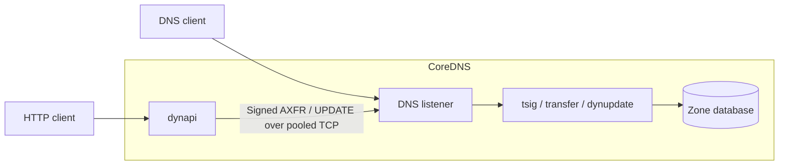

# dynapi 


## Name

*dynapi* - manage CoreDNS address records through an HTTP API.

## Description

*dynapi* is an external CoreDNS plugin. Applications can read,
replace, and delete A and AAAA record sets using an authenticated JSON HTTP API.
The plugin sends signed DNS UPDATE transactions to *dynupdate* over loopback
TCP. Dynupdate owns authoritative answers, permissions, persistence, and
atomic updates. The *tsig* plugin authenticates the DNS requests.

See [examples](examples/README.md) for a starter Corefile and annotated Go client.

See [CONTRIBUTING.md](CONTRIBUTING.md) for contribution guidelines.

Contributions follow the [CoreDNS code of conduct](CODE_OF_CONDUCT.md) and
[Apache-2.0 license](LICENSE). Report security concerns through the
[CoreDNS security policy](SECURITY.md).

## Architecture

Dynapi runs inside CoreDNS and exposes a separate HTTP listener. It validates
requests and sends signed DNS requests over loopback TCP to the same server.
Dynupdate owns the records, write permissions, and persistence.



GET reads a zone snapshot through AXFR. PUT and DELETE use DNS UPDATE
transactions. Ordinary DNS queries continue through the CoreDNS plugin chain.
The HTTP bearer token and DNS TSIG key are separate credentials.

See the [architecture guide](docs/architecture.md) for request flow and limits,
and [ADR 0001](docs/adr/0001-use-signed-dns-for-record-access.md) for the design
decision and trade-offs.

## Installation

Build with Go 1.27 or newer. For development, build the CoreDNS executable
from this repository:

```sh
make                 # Build CoreDNS with dynapi, dynupdate, and tsig.
./coredns -plugins   # Check that all three plugins are included.
```

To include the plugin in another CoreDNS build, add this entry to `plugin.cfg`
after `acl`:

```text
dynapi:github.com/coredns/dynapi/plugins/dynapi
```

Then resolve a reviewed dynapi revision and rebuild CoreDNS:

```sh
go get github.com/coredns/dynapi/plugins/dynapi@REVISION
go generate coredns.go
go build -o coredns .
```

Replace `REVISION` with a commit or release tag. There is no dynapi release
yet. `plugin.cfg.yaml` records the intended placement for external build
tooling. The root executable sets the same placement in Go.

The development executable includes `dynupdate` and `tsig` from a pinned
CoreDNS revision. Both the HTTP listener and DNS bridge use loopback addresses.

### Configure the API and DNS backend

`dynupdate` serves the records and persists changes. `tsig` authenticates DNS
UPDATE requests before dynupdate applies its permission rules. TSIG authenticates
DNS clients. HTTP clients authenticate with a separate bearer token. GET uses
a signed AXFR transfer to read an exact record set from one zone snapshot.

Create `example.org.zone` with the initial zone records:

```dns
$ORIGIN example.org.  ; Resolve relative names within this zone.
@ 60 IN SOA ns.example.org. hostmaster.example.org. 1 3600 600 86400 60 ; Define the zone and its initial serial.
@ 60 IN NS ns.example.org. ; Declare the authoritative nameserver.
ns 60 IN A 127.0.0.1 ; Point the nameserver at this local example.
```

Create a `Corefile`:

```corefile
example.org:1053 { # Serve the example zone on an unprivileged port.
    bind 127.0.0.1 # Keep this development server on loopback.

    dynapi 127.0.0.1:8080 { # Listen for authenticated HTTP requests on loopback.
        token_env DYNAPI_TOKEN # Read the HTTP bearer token from the environment.

        upstream 127.0.0.1:1053 # Send DNS requests to this server block over TCP.

        identity update-key.example.org. # Use this key's dynupdate write permissions.
        secret_env DYNAPI_TSIG_SECRET # Sign DNS requests with the shared TSIG key.
    }

    tsig { # Authenticate signed DNS requests.
        secret update-key.example.org. {$DYNAPI_TSIG_SECRET} # Read the shared key from the environment.

        require_opcode UPDATE # Reject unsigned DNS updates.
        require AXFR # Require authentication for the API's zone reads.
    }

    transfer { # Let the API read the stored zone without wildcard expansion.
        to 127.0.0.1 # Permit zone transfers only to loopback clients.
    }

    dynupdate { # Serve the writable authoritative zone.
        file example.org.zone # Seed a new database with the initial zone.
        database example.org.db # Preserve committed changes across restarts.

        allow update-key.example.org. host.example.org. A AAAA # Restrict this key to one host's addresses.
    }
}
```

Start the DNS backend:

```sh
export DYNAPI_TOKEN="$(openssl rand -hex 32)" # Generate the HTTP bearer token.
export DYNAPI_TSIG_SECRET="$(openssl rand -base64 32)" # Generate a private shared key for this example.
./coredns -conf Corefile # Start the configured DNS server.
```

Keep both credentials when clients must continue using them after a restart.
The bearer token permits reads throughout this zone. Writes must match the
TSIG identity's `dynupdate allow` rules. Restart CoreDNS to change configuration.
This version rejects Corefile reloads while keeping the existing service running.

## Syntax

```corefile
dynapi [ADDRESS] {
    token_env VARIABLE # Or token TOKEN to set the value directly.
    upstream ADDRESS
    max_requests 32 # Limit active HTTP requests and backend DNS connections.
    identity KEY
    secret_env VARIABLE # Or secret BASE64_SECRET to set the value directly.
}
```

The HTTP address defaults to `127.0.0.1:8080`. Both addresses must be literal
loopback IPs with ports. `upstream` must point to the DNS listener in the same
server block, which must contain `dynupdate`, `tsig`, and `transfer` for one zone.
DNS-over-TCP must be enabled.

Configure exactly one form of each credential. Literal credentials are
sensitive, so protect the Corefile. Tokens must contain at least 32 characters
without whitespace. TSIG secrets must be base64 encoding at least 16 bytes.
The key uses HMAC-SHA256.

## API

See [openapi.yaml](openapi.yaml) for the generated API specification, schemas,
and responses. Run `make openapi` after changing the operations or Go models.
`make verify` checks that the specification is current.

```text
/v1/zones/{zone}/records/{name}/{type}
```

Names must be full names within the configured zone. A trailing dot is optional.
Wildcards and escaped names are not accepted. Types are A and AAAA.

- GET returns the exact stored set as `{"ttl":60,"addresses":["192.0.2.10"]}`.
- PUT replaces the complete set atomically and returns its normalized payload.
- DELETE removes that type's set and returns 204, including when it is absent.

PUT requires `Content-Type: application/json`, an explicit TTL from 0 to
2147483647, and 1–256 addresses of the requested family. Duplicate addresses
are removed. IPv4-mapped and scoped IPv6 addresses are rejected. Request bodies
are limited to 64 KiB. JSON field names are case-sensitive. Duplicate keys,
unknown fields, and invalid UTF-8 are rejected. TTL controls DNS caching and
does not expire records.

```sh
curl -X PUT http://127.0.0.1:8080/v1/zones/example.org/records/host.example.org/A \
  -H "Authorization: Bearer $DYNAPI_TOKEN" \
  -H 'Content-Type: application/json' \
  -d '{"ttl":60,"addresses":["192.0.2.10","192.0.2.11"]}'

curl http://127.0.0.1:8080/v1/zones/example.org/records/host.example.org/A \
  -H "Authorization: Bearer $DYNAPI_TOKEN"

curl -X DELETE http://127.0.0.1:8080/v1/zones/example.org/records/host.example.org/A \
  -H "Authorization: Bearer $DYNAPI_TOKEN"
```

Errors use `{"code":"invalid_address","error":"description"}`. Clients should
branch on the stable `code`, rather than the message. OpenAPI lists the codes
allowed for each status. Missing authentication returns 401,
malformed JSON or unknown fields 400, invalid values 422, missing sets 404,
unsupported methods 405, CNAME conflicts 409, oversized bodies 413, and
unsupported content types 415. Dynupdate
permission or capacity rejection returns 403. Transport and backend failures
return 502. Requests above `max_requests` return 503 immediately. The default
is 32. Set a positive integer to change it. The same limit bounds the pool of
reusable backend DNS connections. It does not limit idle HTTP connections or
requests per second.

GET scans a full zone transfer, bounded to 10001 records including the repeated
SOA, and 16 MiB of DNS records. This first version is intended for small zones.
It does not expand wildcards or follow CNAMEs. Existing sets with mixed TTLs
return the lowest TTL. Reads do not reuse dynupdate's write permission rules.

A failed connection or lost HTTP response can follow a committed write.
There are no automatic retries or conditional writes. External DNS caches
can keep older answers until their TTL expires.

## Benchmarks

Run the allocation and timing benchmarks:

```sh
make benchmark
```

Local results with Go 1.27.0:

```text
$ make benchmark
go test -tags=grpcnotrace -run '^$' -bench . -benchmem ./plugins/dynapi
goos: darwin
goarch: arm64
pkg: github.com/coredns/dynapi/plugins/dynapi
cpu: Apple M5 Pro
BenchmarkServeHTTP/GET-18         	  643478	      1846 ns/op	    7191 B/op	      36 allocs/op
BenchmarkServeHTTP/PUT-18         	  530602	      2210 ns/op	    7329 B/op	      40 allocs/op
BenchmarkServeHTTP/DELETE-18      	  667378	      1691 ns/op	    7022 B/op	      32 allocs/op
BenchmarkServeHTTP/unauthorized-18         	  884338	      1415 ns/op	    6831 B/op	      29 allocs/op
BenchmarkServeHTTP/invalid_address-18      	  465476	      2299 ns/op	    7459 B/op	      42 allocs/op
BenchmarkAdd/lowercase-18                  	  171843	      6861 ns/op	      32 B/op	       2 allocs/op
BenchmarkAdd/uppercase-18                  	  175131	      6856 ns/op	      32 B/op	       2 allocs/op
BenchmarkNormalize/A/1-18                  	44136915	        26.78 ns/op	      16 B/op	       1 allocs/op
BenchmarkNormalize/A/256-18                	  144397	      8308 ns/op	    4864 B/op	       1 allocs/op
BenchmarkNormalize/AAAA/1-18               	20398362	        58.08 ns/op	      32 B/op	       2 allocs/op
BenchmarkNormalize/AAAA/256-18             	   67185	     17841 ns/op	    4880 B/op	       2 allocs/op
PASS
ok  	github.com/coredns/dynapi/plugins/dynapi	13.401s
```

These benchmarks include request construction, authentication, routing, and
response encoding. They use one address and an in-memory backend, so they
exclude network, DNS transfer, and disk costs. Results vary by machine.
Normalization benchmarks also cover 1 and 256 addresses for both A and AAAA.
