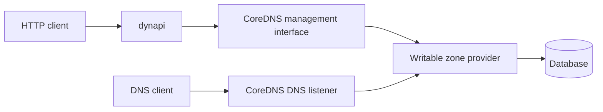

# ADR 0002: Add a CoreDNS record management interface

Status: Proposed

Date: 2026-10-01

## Decision

Add a Go interface to CoreDNS for reading, replacing, and deleting stored record
sets. Dynapi would call the zone provider directly. This would avoid loopback
DNS connections, full-zone transfers, and TSIG credentials in dynapi.

The zone provider stores the records and serves them through DNS. It must apply
changes atomically, persist them, check permissions, and reject CNAME conflicts.
CoreDNS would find providers by zone and manage their startup and shutdown.
Reads would return stored sets without expanding DNS answers.

Removing dynupdate also requires a replacement writable zone provider. The
interface alone cannot store records. Dynupdate could implement it first while
dynapi switches to the shared interface.

## Rejected

- Adding only a public dynupdate method keeps dynapi tied to that plugin.
- Giving dynapi its own store creates separate ownership of HTTP mutations and
  DNS answers.
- Allowing writes through every DNS plugin would treat read-only and computed
  answers as stored records.
- Using only DNS UPDATE and AXFR keeps the DNS transport and whole-zone read
  costs, even with connection pooling.

## Future

Agree the interface upstream before changing dynapi. Start with exact A and
AAAA sets and explicit errors. Define permissions, when a write is durable,
and how cached answers are invalidated.

Define how reloads replace providers without sending requests to a retired
zone. Conditional writes need record revisions to prevent clients from
overwriting each other.

Decide whether the writable provider ships with CoreDNS or as an optional
plugin. Keep the HTTP API unchanged during migration. Use the signed DNS adapter
in [ADR 0001](0001-use-signed-dns-for-record-access.md) until the interface and
provider are available.
