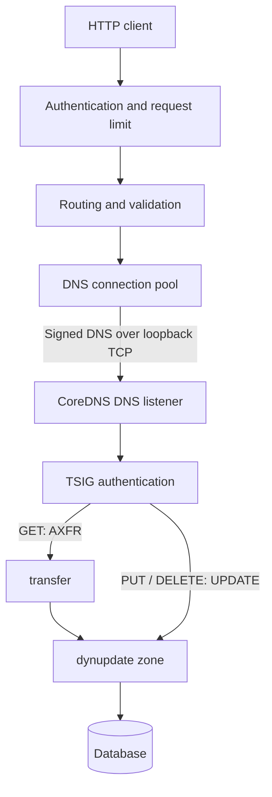

# Architecture

Dynapi manages A and AAAA records in one zone through HTTP. It runs inside
CoreDNS. Dynupdate stores the records and serves DNS answers. Dynapi passes
ordinary DNS requests to the next plugin.

## Request flow

The [HTTP handler](../plugins/dynapi/handler.go) checks the bearer token before
accepting work. It uses `net/http.ServeMux`, checks the zone, record name, and
address family, and sets a five-second deadline. PUT uses `encoding/json/v2`
and normalizes, sorts, and deduplicates addresses.

The [DNS backend](../plugins/dynapi/backend.go) signs requests with the configured
TSIG key using HMAC-SHA256:

- GET reads an AXFR zone snapshot and selects the exact name and type. It sorts
  addresses and returns the lowest TTL without following CNAMEs or expanding
  wildcards.
- PUT removes the old set and adds the new set in one DNS UPDATE transaction.
  The transaction rejects an existing CNAME.
- DELETE removes only the requested type. Deleting an absent set succeeds.

TSIG authenticates the DNS identity. Dynupdate checks its write permissions and
commits changes to the database. Transfer rules control reads. The HTTP token
allows reads across the zone, even when write permissions cover only some names.

## Bounds and failures

The handler accepts up to `max_requests` authenticated requests at once and
returns 503 for additional requests. The default is 32 and must be a positive
integer. This bounds backend DNS connections, not idle HTTP connections. We
have not established the best default. There is no requests-per-second quota. PUT accepts up to 64 KiB and 1 to 256 addresses.
AXFR scans stop above 10001 records, including the repeated SOA, or 16 MiB.

Connection failures return 502. A write may commit before its response is lost,
so dynapi does not retry updates. Clients can use stable error codes. Concurrent
writes can overwrite each other. DNS caches can keep old answers until their
TTL expires.

Reads and writes borrow TCP connections from a pool bounded by `max_requests`.
Each connection serves one operation at a time. Dynapi returns it only after
reading the full response. It discards failed or canceled connections and
retires connections before the DNS listener's idle timeout or query limit.
Shutdown closes idle and borrowed connections after HTTP draining.

GET still scans the full zone. Sustained load tests must guide concurrency
changes. Handler benchmarks do not include the DNS or storage costs.

## Lifecycle and API contract

[Startup](../plugins/dynapi/dynapi.go) requires dynupdate for the zone, plus tsig
and transfer. The upstream must match the same server block's DNS listener.
Both addresses must be literal loopback IPs. Shutdown allows five seconds for
HTTP requests to finish, then forces the server closed if needed. Dynapi rejects
Corefile reloads and keeps the running service. Configuration changes require
a restart.

[Operation definitions](../plugins/dynapi/operations.go) register routes and
generate OpenAPI from Go models. `make openapi` updates the specification.
`make verify` checks it for drift and runs lint, build, vet, and race checks.
Handlers and models still validate requests and need behavior tests.

`make integration` runs CoreDNS with race detection. It checks HTTP changes
against UDP and TCP DNS replies, persistence after restart, permissions, CNAME
conflicts, concurrent clients, and rejected reloads. See
[ADR 0001](adr/0001-use-signed-dns-for-record-access.md) for why the adapter uses
the DNS protocol.
